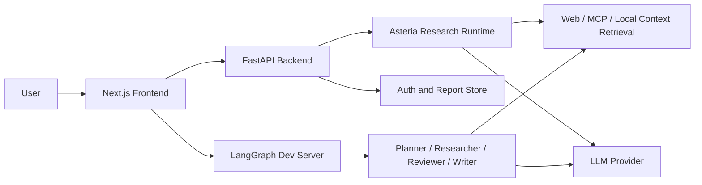

# Asteria Agent

Asteria Agent is an AI research assistant built around LangChain and LangGraph. It helps turn an open-ended research question into a structured workflow: query planning, web retrieval, source reading, report drafting, follow-up chat, and optional multi-agent collaboration.

The project is adapted from an open-source deep-research agent architecture and extended for local development, authenticated usage, and LangGraph-based research orchestration.

## Preview

Screenshots will be added here after the UI capture is ready.

<!--


-->

## Highlights

- Research workflow: decomposes a topic into sub-questions, gathers sources, summarizes evidence, and generates structured reports.
- LangGraph multi-agent mode: supports Planner, Researcher, Reviewer, Reviser, Writer, Publisher, and Editor nodes for deeper research tasks.
- Interactive report workspace: provides streaming logs, source cards, generated images, report sections, and follow-up chat over completed reports.
- Local-first setup: runs the FastAPI backend, Next.js frontend, and LangGraph service locally without Docker.
- Authentication layer: adds passwordless email-code login, JWT-based session handling, and user-scoped report persistence.
- Extensible retrieval: supports web retrievers and can be expanded with MCP tools, local document ingestion, and vector-store context.

## Tech Stack

- Backend: Python, FastAPI, Uvicorn, Pydantic, SQLAlchemy
- Agent framework: LangChain, LangGraph, LangGraph SDK, LangSmith-compatible tracing
- Retrieval and parsing: DuckDuckGo/Tavily-style web retrieval, BeautifulSoup, PyMuPDF, Unstructured, tiktoken
- Frontend: Next.js, React, TypeScript, Tailwind CSS, Framer Motion
- Storage and auth: PostgreSQL-compatible persistence, JWT, email verification code login
- Tooling: Poetry/uv-compatible Python dependencies, npm, local shell scripts

## Architecture



## Local Development

### 1. Prepare environment

Create a `.env` file in the project root. Do not commit real API keys.

```bash
OPENAI_API_KEY=
TAVILY_API_KEY=
LANGCHAIN_API_KEY=
JWT_SECRET=change-me
SMTP_HOST=
SMTP_PORT=
SMTP_USERNAME=
SMTP_PASSWORD=
```

The local setup can also use OpenAI-compatible providers such as DeepSeek by configuring the corresponding model and base URL variables.

### 2. Install dependencies

```bash
python3 -m venv .venv
source .venv/bin/activate
pip install -r requirements.txt

cd frontend/nextjs
npm install
```

### 3. Start services

The easiest path is the local startup script:

```bash
./start-local.sh
```

Manual startup is useful for debugging:

```bash
# Terminal 1: backend
source .venv/bin/activate
uvicorn main:app --host 0.0.0.0 --port 8000 --reload

# Terminal 2: frontend
cd frontend/nextjs
npm run dev

# Terminal 3: optional LangGraph multi-agent service
source .venv/bin/activate
langgraph dev --port 2024 --config langgraph-multiagent.json --no-browser --no-reload --allow-blocking
```

### 4. Open the app

- Frontend: http://localhost:3000
- Backend API: http://localhost:8000
- LangGraph service: http://localhost:2024

For more detailed local notes, see [LOCAL_DEV.md](LOCAL_DEV.md).

## Project Structure

```text
.
├── backend/                 # FastAPI server, auth, report APIs, chat APIs
├── frontend/nextjs/         # Next.js research interface
├── asteria_researcher/      # Core research runtime, retrievers, scrapers, prompts
├── multi_agents/            # LangGraph multi-agent research workflow
├── langgraph-multiagent.json
└── start-local.sh
```

## Roadmap

- Add project screenshots and architecture images to the README.
- Integrate local paper-library retrieval and citation-aware RAG.
- Add persistent user workspaces for saved research reports and source collections.
- Improve report evaluation with hallucination checks and citation coverage metrics.

## Acknowledgements

This project builds on ideas and implementation patterns from the open-source GPT Researcher project while reshaping the repository around Asteria Agent's local workflow. Thanks to the GPT Researcher and LangChain communities for the underlying research-agent ecosystem.

## License

This repository follows the upstream MIT license where applicable. See [LICENSE](LICENSE).
