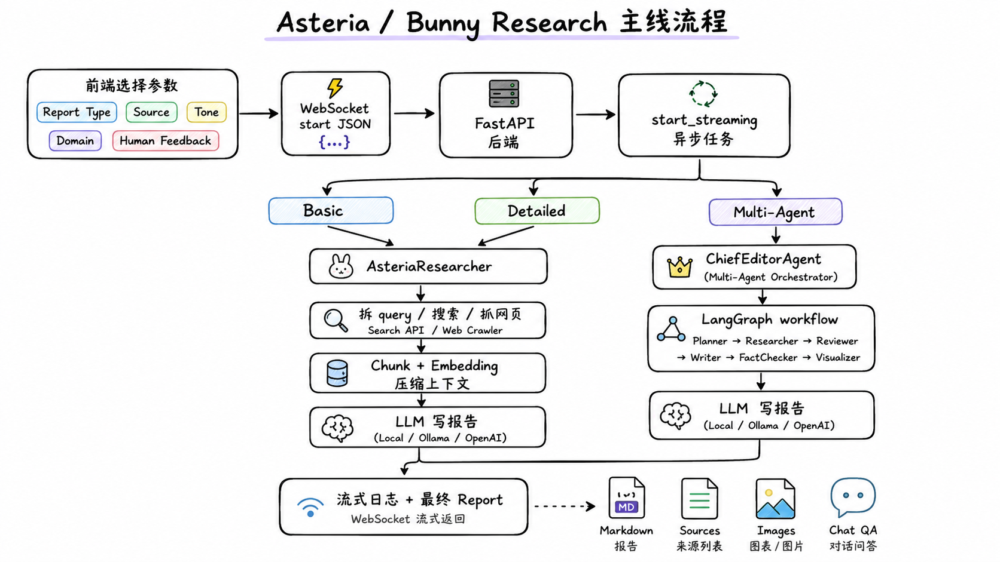
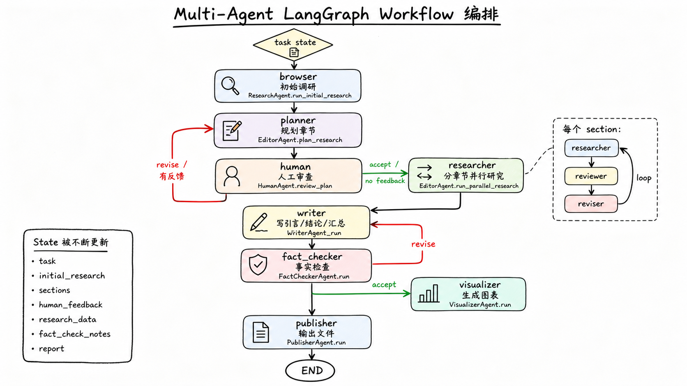

# 🐰 Asteria Agent

> 本地优先的 AI 调研助手:输入一个问题,它会自动拆解子查询、联网检索、阅读来源,产出一份带真实引用的调研报告——生成后还可以继续与报告对话。

## ✨ 功能特性

| | 特性 | 说明 |
|---|---|---|
| 🔍 | **可溯源调研** | 子查询拆解 → 检索抓取 → embedding 相关性过滤 → 带引用写作,引用来自真实访问记录而非 LLM 输出;报告导出 Markdown / Word / PDF |
| 🤖 | **多智能体模式** | LangGraph `StateGraph` 编排研究角色,支持大纲人工审核与章节级并行 |
| 🔐 | **多用户** | 邮箱验证码 + JWT 鉴权,调研历史按用户隔离存储于 PostgreSQL |
| 📡 | **实时交互** | WebSocket 流式推送调研进度;可对已生成报告继续追问 |
| 🔌 | **模型无关** | LLM 与 embedding 均走 OpenAI 兼容规范,任意 provider(含本地 Ollama)一行配置切换 |

## 🏗️ 架构

代码库沿一条清晰的边界拆分:

- **`asteria_researcher/`** — 自包含的调研引擎(检索、抓取、prompt、LLM 抽象、报告写作),完全不感知 Web 层,可作为纯 Python 库独立使用
- **`backend/`** — 包在引擎外面的 FastAPI 服务层:路由、鉴权、WebSocket 推送、PostgreSQL 持久化
- **`frontend/nextjs/`** — Web 界面:调研控制台、实时日志、报告阅读、对话
- **`multi_agents/`** — LangGraph 多智能体工作流(planner → 人工审核 → 并行 researcher → writer → fact-checker)

## 🗺️ Roadmap

- [ ] **实验室知识库(RAG)** — 基于 pgvector 对内部文献与笔记做混合检索(BM25 + dense + RRF 融合),cross-encoder 重排序,封装为 MCP server 供本应用与其他 agent 共同调用
- [ ] 检索评估集与指标对比(hybrid vs. dense-only)
- [ ] 生产部署(Docker、`next build`、云主机)
- [ ] 成本看板(单次调研的 token / 费用明细)

## 🙏 致谢

基于优秀的开源项目 [GPT Researcher](https://github.com/assafelovic/gpt-researcher) 的思路与实现模式构建,并围绕本地优先工作流、按用户持久化与不同的鉴权/存储架构进行了重塑。
