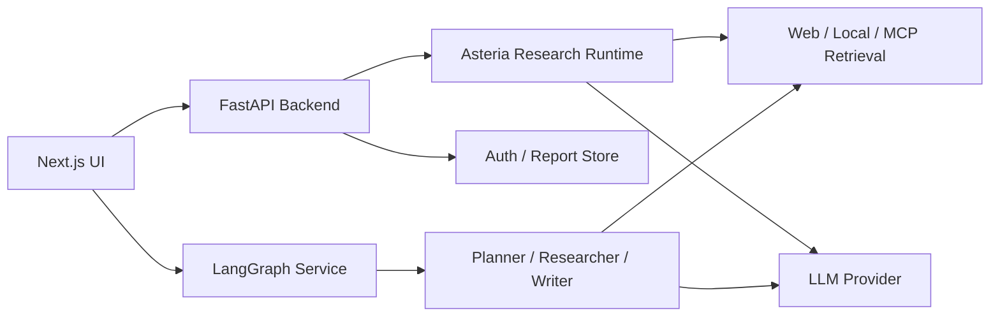

# Asteria Agent

Asteria Agent is a local-first AI research assistant built with LangChain, LangGraph, FastAPI, and Next.js. It turns a research question into a traceable workflow: plan, retrieve, read, summarize, write, and chat with the generated report.

## Preview

Screenshots will be added here after the UI capture is ready.

<!--


-->

## Architecture



## Directory Guide

- `asteria_researcher/`: core research runtime, including retrieval, scraping, prompts, LLM calls, report writing, and MCP support.
- `backend/`: FastAPI service layer for auth, report APIs, chat APIs, WebSocket streaming, and report persistence.
- `frontend/nextjs/`: Next.js web interface for starting research tasks, viewing logs, reading reports, and chatting with results.
- `multi_agents/`: LangGraph multi-agent workflow for planner/researcher/reviewer/writer style research tasks.
- `langgraph-multiagent.json`: LangGraph dev-server entrypoint for the multi-agent graph.
- `start-local.sh`: local startup script for backend, frontend, and optional LangGraph service.

## Run Locally

```bash
python3 -m venv .venv
source .venv/bin/activate
pip install -r requirements.txt

cd frontend/nextjs
npm install
cd ../..

./start-local.sh
```

Services:

- Frontend: http://localhost:3000
- Backend API: http://localhost:8000
- LangGraph service: http://localhost:2024

## Environment

Create a local `.env` file from `.env.example`. Keep real API keys and SMTP credentials out of Git.

## Acknowledgements

This project builds on ideas and implementation patterns from the open-source GPT Researcher project while reshaping the repository around Asteria Agent's local workflow.
