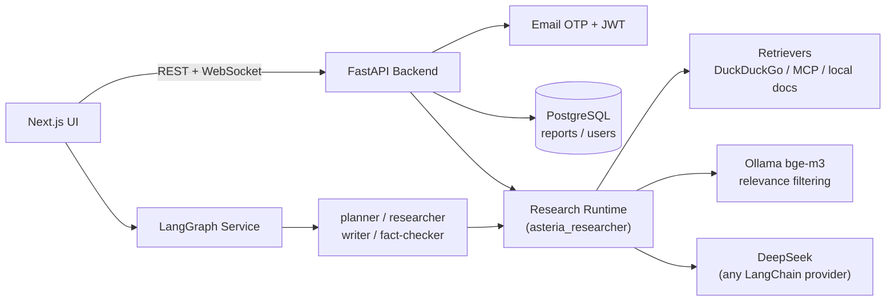

# 🐰 Asteria Agent

> A local-first AI research assistant: give it a question, it plans sub-queries, searches the web, reads sources, and writes a fully cited research report — then lets you chat with the result.


## ✨ Features

| | Feature | How it works |
|---|---|---|
| 🔍 | **Traceable web research** | LLM plans sub-queries → multi-engine retrieval → full-page scraping → embedding-based relevance filtering → report writing with real, verified citations (`visited_urls` safety net, never hallucinated links) |
| 🤖 | **Multi-agent mode** | LangGraph `StateGraph` orchestrating planner / researcher / writer / fact-checker roles, with human-in-the-loop plan review and parallel per-section deep dives |
| 🔐 | **Passwordless auth** | Email OTP login → JWT (HS256) → FastAPI `Depends()` route guards; WebSocket auth via query-param token with proper 4401 close-code propagation |
| 🗄️ | **Per-user persistence** | Report history in PostgreSQL with row-level ownership filtering — users only ever see their own data |
| 📡 | **Live progress streaming** | WebSocket channel streams every research step (searching, scraping, writing) to the UI in real time |
| 💬 | **Chat with your report** | Ask follow-up questions against any generated report |
| 🖥️ | **Local-first & low-cost** | DeepSeek for generation, local Ollama `bge-m3` for embeddings (free, offline, bilingual), DuckDuckGo retrieval (no API key) |
| 📄 | **Multi-format export** | Every report lands as Markdown + Word + PDF |

## 📸 Preview

<!-- TODO: screenshots


-->

*Screenshots coming soon.*

## 🏗️ Architecture



The repo is split along one clear boundary:

- **`asteria_researcher/`** — a self-contained research engine (retrieval, scraping, prompts, LLM abstraction, report writing). Knows nothing about the web layer; usable as a plain Python library.
- **`backend/`** — the FastAPI shell around it: routing, auth, WebSocket streaming, Postgres persistence.
- **`frontend/nextjs/`** — the web UI: research console, live logs, report reader, chat.
- **`multi_agents/`** — the LangGraph multi-agent workflow (planner → human review → parallel researchers → writer → fact-checker).

## 🚀 Run Locally

**Prereqs:** Python 3.13+, Node 20+, PostgreSQL, [Ollama](https://ollama.com) with `bge-m3` pulled.

```bash
# 1. Python env
python3 -m venv .venv
source .venv/bin/activate
pip install -r requirements.txt

# 2. Frontend deps
cd frontend/nextjs && npm install && cd ../..

# 3. Config - copy the template and fill in your keys
cp .env.example .env

# 4. Everything up (backend :8000, frontend :3000, langgraph :2024)
./start-local.sh
```

| Service | URL |
|---|---|
| Web UI | http://localhost:3000 |
| Backend API docs | http://localhost:8000/docs |
| LangGraph service | http://localhost:2024 |

## 🔧 Configuration

All runtime config lives in `.env` (see `.env.example`). Key entries:

```bash
FAST_LLM=deepseek:deepseek-chat        # any LangChain-supported provider works
EMBEDDING=ollama:bge-m3                # local, free, bilingual
RETRIEVER=duckduckgo                   # no API key required
DATABASE_URL=postgresql://...          # auth + report storage
JWT_SECRET=...                         # session signing
SMTP_HOST=...                          # OTP delivery
```

Real keys and SMTP credentials never enter Git.

## 🗺️ Roadmap

- [ ] **Lab knowledge base (RAG)** — hybrid retrieval (BM25 + dense + RRF fusion) over internal papers & notes with pgvector, cross-encoder reranking, exposed as an MCP server so both this app and other agents can query it
- [ ] Retrieval evaluation set + metrics (hybrid vs. dense-only)
- [ ] Production deployment (Docker, `next build`, cloud VM)
- [ ] Cost tracking dashboard (per-research token/cost breakdown)

## 🙏 Acknowledgements

Built on ideas and implementation patterns from the excellent open-source [GPT Researcher](https://github.com/assafelovic/gpt-researcher) project, reshaped around a local-first workflow, per-user persistence, and a different auth/storage architecture.
