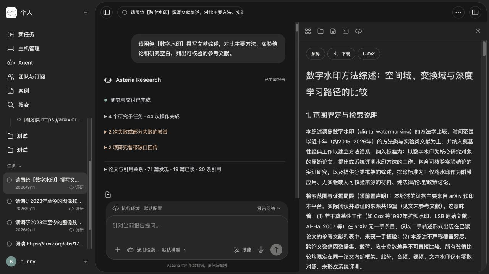
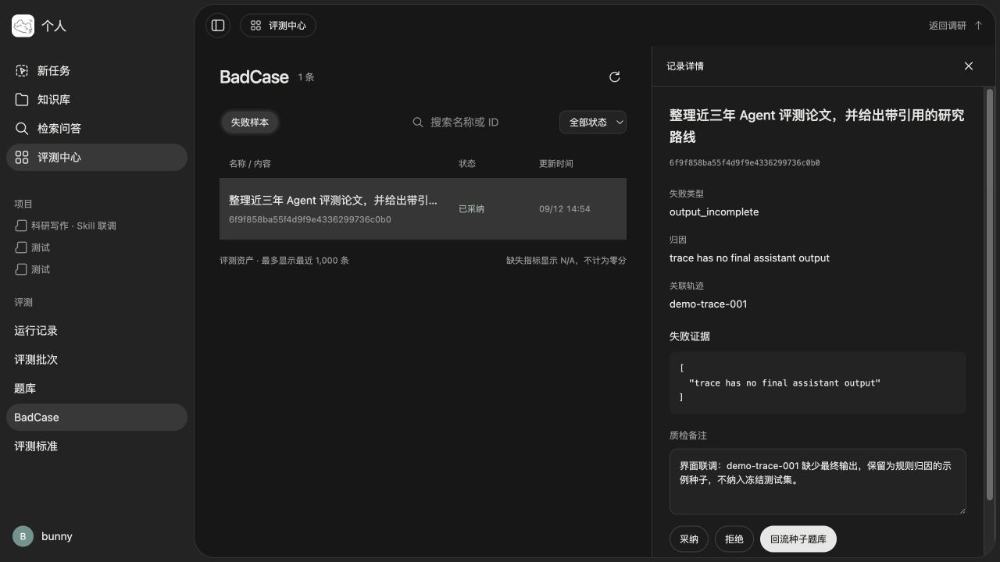

# 🐰 Asteria Agent

面向文献调研、综述写作和实验设计的科研智能体工作台。用自然语言描述目标，Agent 自主规划、委派研究、阅读与追踪论文，在证据充分后交付带引用的报告。

Python · LangGraph · FastAPI · Next.js · PostgreSQL · Ollama

## ✨ 能做什么

- **自主研究**：根据任务目标安排检索、原文阅读与引用追踪，动态委派并行研究 Agent；计划支持人工确认与修订，补研依据证据缺口，而不是固定章节流水线。
- **按需使用 Skill**：Agent 发现技能并按阶段加载，用户也可查看、指定技能。内容写作指导、格式契约、LaTeX 模板和编译工具分别维护。
- **报告交付**：生成 Markdown、LaTeX 与 PDF，在工作台检查报告、源码、研究轨迹和引用关系；支持围绕报告继续问答。
- **项目与知识库**：项目组织多轮对话，历史内容持久化到 PostgreSQL。离线 RAG 保留独立入口，支持混合检索与重排；在线研究可选择启用 RAG。
- **后台运行**：桌面研究由独立 worker 执行，刷新或关闭页面不终止任务；进度、人工确认、模型用量与交付产物持久保存，重新打开即可继续查看。
- **评测工作台**：查看研究历史、导入 Trace、展开父子调用、检查规则报告；对 BadCase 质检并回流种子题库。当前自主运行时的语义评分与版本对比正在接入。

## 🖥️ 工作台

已完成的文献综述：研究进度与报告并排查看，细节按需展开。

评测中心：示例 Trace 的规则归因、人工质检与种子回流，共用研究工作台的侧栏和详情面板。

## 🛠️ 开发

当前本地开发使用 **Python 3.10（dora）与 Node.js 22**；Next.js 为 14.2 系列。研究 API、前端与 Embedding 服务独立运行，模型凭据保存在本地环境配置中。

- [开发规范与当前进度](spec.md)
- [界面设计规范](DESIGN.md)
- [开发节点与真实运行记录](DEVELOPMENT_LOG.md)
- [后台任务与服务启动](docs/durable-runs.md)
- [评测工作台与评分策略](docs/evaluation-workspace.md)
- [自主实验与评测路线](docs/experiment-evaluation-roadmap.md)

调研引擎位于 `asteria_researcher/`，API 与持久化位于 `backend/`，Web 工作台位于 `frontend/nextjs/`。既有 LangGraph 工作流保留在 `multi_agents/`，与自主研究运行时分开维护。

## 🗺️ 接下来

- 授权主机与工作区内的自主实验执行、日志观察和结果复现。
- 当前 Agent 的历史补评、独立裁判、版本对比与 BadCase 回归。
- 进程异常后的检查点恢复、模型费用计价与运行指标展示。

## 🙏 致谢

项目从 [GPT Researcher](https://github.com/assafelovic/gpt-researcher) 的开源实现起步，也从 [STORM](https://github.com/stanford-oval/storm) 的多视角研究方法中获得了启发。感谢这些工作让科研助手的探索有了扎实的起点。

界面交互参考 [ClawsGO](https://clawsgo.cn/) 与 Codex。引入的第三方技能材料保留各自的来源与许可证。
