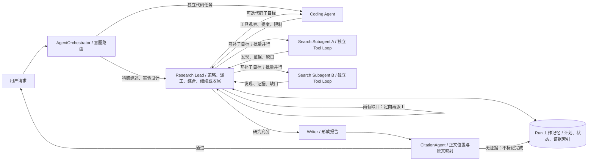
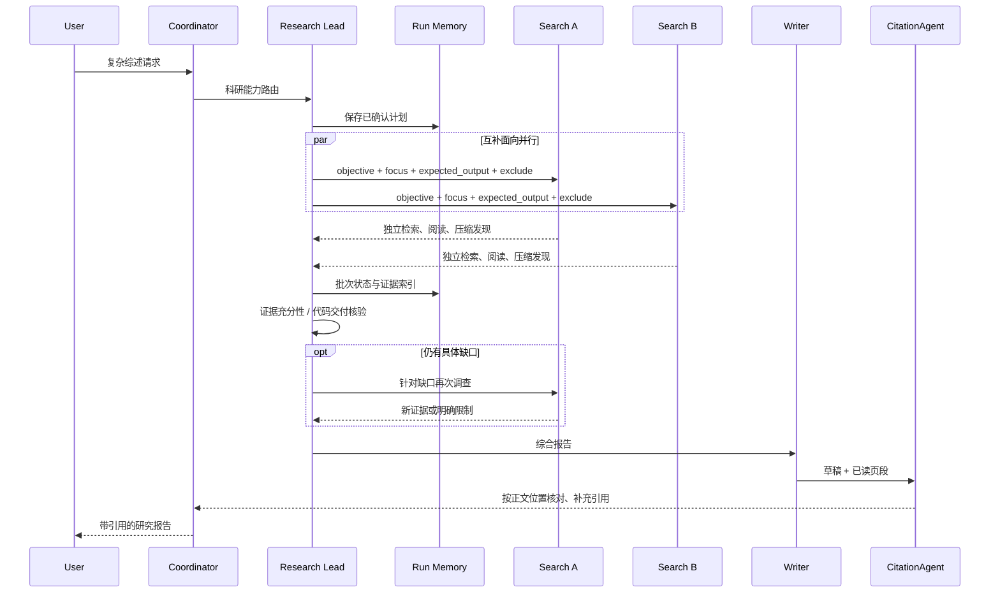

# Asteria 科研链路：参考 Anthropic Research 的架构对齐草案

日期：2026-09-24。状态：**框架链路已接入代码并通过替身回归测试；真实模型的复杂综述端到端质量尚待实测。** 以 Anthropic 的科研协作架构和职责为参考，不复制其未披露的技术栈；保留按批等待；用 CitationAgent 替换当前在线 Reviewer，而不是仅更名。

## 当前可用于面试讲解的 Asteria 架构图

这里的 **Coordinator 是 Asteria 的产品入口**，不冒充 Anthropic 图中原本不存在的跨业务路由。Lead 的 `checkpoint` 是我们的工程核验：每批子任务回收后触发，依据有无原文证据及剩余目标决定收尾或继续。`working-memory.json` 存计划引用、剩余目标和阶段状态，每轮 Lead 决策会读取这个快照；`plan.json`、`delegations.json`、`evidence.json` 存完整内容。当前不是断点续跑的通用引擎。CitationAgent 在 Writer 之后审阅正文行与已读页段的映射，不能取代事实真实性的人审，也不会把一个合法 URL 自动当作论据。

一手资料：[Anthropic, *How we built our multi-agent research system*（2025-06-13）](https://www.anthropic.com/engineering/multi-agent-research-system)，重点看 Architecture overview、Prompt engineering、Production reliability 与 Appendix。本文区分 **原文披露**、**Asteria 当前实现**、**建议设计**；不能从示意图倒推出 Anthropic 未公开的代码、数据结构或停止阈值。

## 1. 总体边界：两个不同的入口

- **原文披露**：用户提出研究请求，系统创建 LeadResearcher；Lead 制定研究策略、产生各自负责不同面向的搜索子 Agent、综合发现，决定继续研究还是完成；研究结果和报告随后交给 CitationAgent 定位引文。文章没有介绍一个 EchoMind 式的跨业务意图分类器。
- **Asteria 当前**：`AgentOrchestrator` 做意图识别/澄清及业务入口路由；综述与实验设计交给 `research_lead`。`AutonomousReview` 做研究计划、并行委派和报告生成。这是产品所需的外层入口，不能说成 Anthropic 图中的 Lead 本身。
- **建议设计**：保留外层 Coordinator，但让 Research Lead 的职责尽量贴合原文。独立代码任务直接进入 Coding Agent；包含文献研究和代码分析的复合交付由 Lead 负责整体，再定向委派代码子目标。**独立路由与被 Lead 调用不冲突**。修改文件、执行实验必须受当前实际工具能力与审批边界约束，不能把只读调查/提案写成已执行。

## 2. Lead 的职权：研究策略、派工、综合和继续/收尾

**原文披露**：Lead 分析请求、制定策略，并把不同研究面向交给并行子 Agent。每个子 Agent 独立搜索、评估工具结果，再将压缩后的发现返回；Lead 综合结果，判断是否还需要研究，必要时再派工或调整策略。原文还强调根据查询复杂度分配工作量、先宽后窄搜索、避免让多个子 Agent 做同一件事；没有公开 Lead 的固定停止算法或 Reviewer 门槛。[来源](https://www.anthropic.com/engineering/multi-agent-research-system)

**建议设计**：把现有 `ReviewPlan` 概念上拆成两个层次，而不是把“研究目标/过程要求/交付约束”当成完整的研究计划：

1. **任务契约（小而稳定）**：原始用户目标、来源/执行范围、必须满足的数量或格式要求、禁令、批准状态。逐条保留用户原话，检查能否执行；不再用第二次 LLM 分类悄悄把“至少阅读两篇论文”移出过程要求。
2. **研究策略（动态）**：研究问题、互补调查面向、各面向优先来源、预期证据、未知点、预算和建议写作结构。Lead 可依据发现修改策略；章节只是一种最终组织方式，不必等于子 Agent 边界。
3. **执行中的 Lead**：观察子任务回传与证据覆盖，合并重复发现，识别缺口和冲突；只有针对未解决问题再次派工。达到交付条件则停止搜索，不为耗尽行动预算而研究。

### 综述任务的示例派工

输入：比较科研 Agent 端到端评测中的任务成功、证据忠实性、过程效率和人工校准，至少阅读两篇学术论文，给 10 人实验室提出轻量方案。

| 子任务 | 独立问题与预期输出 | 排除范围 |
| --- | --- | --- |
| A：任务成功 | 指标定义、典型任务集、成功判据、原文证据与局限 | 不代写完整综述；不重复 B/C 的主问题 |
| B：证据忠实性 | 事实/引文如何核对、代表方法、失效案例与原文位置 | 不把检索命中率当成忠实性 |
| C：效率与人工校准 | 成本/延迟/工具效率、人工复核设计、适合小实验室的权衡 | 不凭空声称实验室指标已经实测 |

Lead 可保留跨面向的综合与最终方案，某一路发现方法冲突后再开**针对冲突**的补查。每个任务应交代目标、预期输出、工具/来源指导、边界与预算；不同面向可以引用同一篇论文，但不能仅换标题重复回答同一个问题。原文给出的按复杂度调整子 Agent 数和工具调用量是其经验，不是 Asteria 的固定配置或验收指标。

**Aspect 到底是什么**：由当前请求决定、可相对独立探索的研究切面或子问题，而非固定角色表、资料类型或报告章节。Lead 可以按方法、对象、时间段、地区、争议点等维度拆，但一次派发应选一套能覆盖任务且少重叠的维度。判断分工区分度看“要回答的问题和预期结论”是否不同，而非搜到的论文是否完全不同。Anthropic 没有公开通用的 aspect 生成算法。

**Output format 到底是什么**：指子 Agent 交给 Lead 的统一结果形态，而非要求它写成最终报告。例如 A 的委托可以是：目标＝回答任务成功如何定义与测量；可用来源＝论文原文及权威基准文档；不负责＝忠实性和最终实验室方案；回传＝关键发现、各发现的来源/原文位置、适用条件、反例或不确定处、仍待回答的问题。这样 Lead 能比较、合并并判断是否继续，不必从三篇完整小综述里重新提取证据。

## 3. 子 Agent 交付和并行瓶颈

**原文披露**：子 Agent 有自己的上下文窗口，围绕各自任务迭代使用搜索工具、判断结果，向 Lead 回传压缩发现。文章的生产实现按批同步等待子 Agent；运行中的子 Agent 不能彼此协调，Lead 也不能实时指导它们，慢分支可能拖住整批。原文把这写作已知权衡，而不是多 Agent 不成立的证据。附录还建议子 Agent 可将完整产物持久化到外部，仅把轻量引用交给 Lead。[来源](https://www.anthropic.com/engineering/multi-agent-research-system)

**Asteria 当前**：`dispatch_assignments` 按不同目标派发，`run_parallel` 逐路保存/推送阶段结果，但 Lead 等待整批结束才继续决策；子任务共享整体预算。已有 `delegations.json`、`evidence.json` 和事件日志。

**已对齐的设计选择**：保留按批并行、整批返回后由 Lead 综合和继续派工的模式，不把完全异步调度列为本轮优化目标。子 Agent 默认不直接互发消息；同一批可以共用来源/证据存储，但这不等于互相协调。跨分支的冲突、重复和补查由 Lead 在批次之间处理。前端可逐路展示阶段发现，但注明未综合。慢/失败支路保留已有结果并记录原因；是否加单路超时以实际测试为依据，而非先重做调度器。

## 4. Memory：运行时工作记忆，不等于用户画像向量库

**原文披露**：Lead 将研究计划存入 Memory，使长上下文截断后仍能取回；长任务可总结完成阶段并把关键信息保存到外部记忆，必要时新建干净上下文的子 Agent 做交接；子 Agent 的完整输出可独立持久化、Lead 只接收引用。原文**未披露 Memory 的数据库产品、Redis/ChromaDB 组合、向量检索策略或用户画像机制**。[来源：架构说明与附录](https://www.anthropic.com/engineering/multi-agent-research-system)

**对齐口径**：图中的 Memory 可以直接理解成 **Lead 的外部工作上下文**：计划、阶段摘要、子任务状态、证据引用和未解决问题可写入并取回；它不要求 Lead 永远把全部原文放在模型上下文窗口里。技术实现自行选择，可复用现有基础设施，不以使用与 Anthropic 相同的存储产品为目标。Asteria 仍应区分两种用途：

- 跨会话产品记忆：现有 Redis/ChromaDB 用户画像、历史研究摘要等，服务个性化和召回；这不是 Anthropic 图中 Memory 的已证实实现。
- 单次运行工作记忆：任务契约、可修订计划、每路状态、证据索引、决策依据、阶段摘要与剩余缺口；要求可持久化、可恢复、按用户/Run 隔离。优先复用现有持久化 Run 与 `plan.json`、`delegations.json`、`evidence.json`、事件日志，缺失的仅补最小状态；大文件按引用传递，不反复粘贴进 Lead 上下文。

现有 Redis＋ChromaDB 可按适合的数据类型复用；关键验收点是 Lead 在上下文压缩/任务恢复后还能找回研究计划和有效证据，不是存储品牌。

## 5. 收尾、CitationAgent 与现有 Reviewer：不能仅改名

**原文披露**：Lead 综合子 Agent 发现并决定是否需要继续研究；有充分信息后退出研究循环，CitationAgent **处理文档和研究报告，定位引文的具体位置**，再返回带引文的最终结果。文章未披露独立 Writer 的内部实现，也没有声称 CitationAgent 是独立的目标充分性裁判，或存在“审查三次后强制通过”的机制。文中的 LLM-as-judge 属于**系统评测**，不等于运行时 CitationAgent。[来源](https://www.anthropic.com/engineering/multi-agent-research-system)

**Asteria 改动前**：`ReviewerAgent` 在 Lead 主动 `finish` 或轮次耗尽时检查目标证据与代码交付；通过后 Writer 才生成报告。写作后的校验主要检查引用来源和形式，尚无独立的成稿正文位置引文定位。默认单目标连续 3 次打回停止，复杂综述可能在首轮检查之前重复派工。

**已接入的设计**：CitationAgent **替换在线 Reviewer 角色**；原 `reviewer.py` 暂保留作为旧模块，但在线研究链路不再调用。目标充分性与代码交付核验仍在 Lead checkpoint 中执行，不把 CitationAgent 误用为目标裁判。

1. **Lead 负责研究是否充分**：按 Anthropic 的职责，在一批发现回来后综合覆盖、证据质量和冲突，决定继续/收尾；不足只派发具体缺口。明确硬约束（如至少实读两篇论文）做确定性核验，避免 Lead 凭主观判断漏掉用户要求。这是 Asteria 的工程保护，不假称 Anthropic 原文规定了 Reviewer、检查频次或停止阈值。
2. **Writer 形成稿件后再由 CitationAgent 核引文**：输入最终稿、实际读取的原文/页段及来源元数据；逐行映射至少 20 个汉字的正文行，拒绝未知证据 ID、错配来源或标记为无支持的行，并对通过的行补充来源链接。当前是正文行级而非逐论断事实核验；Markdown 表格、短句及参考文献列表不在此轮映射范围。引用核对不替代目标覆盖检查。
3. **代码/实验要求单独验收**：文件实际变更、测试结果、实验日志等需与工具观察对应；CitationAgent 不负责宣布代码已运行或实验已复现。
4. **有界补研/修稿**：沿用 Asteria 的目标打回预算，而非 Anthropic 的公开参数；只有新证据才值得再次检查。研究目标仍不足时保留审查与证据产物、Run 标记失败/未完成，不改判 `completed`。CitationAgent 发现未支持正文时写入 `citation-review.json` 并阻止已完成交付；后续可增设显式修稿与部分报告发布路径，目前不宣称已实现。

## 6. 本轮已实现与后续验收

已实现：并行批次回收后 Lead 主动 checkpoint；独立 CitationAgent 成稿定位；研究任务可用公开网页搜索发现**受白名单约束**的一手来源；单 Run 工作记忆快照；输出 `citation_review` 与 `working_memory` artifact；配套替身单元测试。研究者仍可独立选择自查或派工，不强制并行，不预设 aspect 数量。已有分工合同中的 `objective/focus/expected_output/exclude` 是委托给子 Agent 的输入契约，不是四个新的固定研究阶段。

未验证：真实模型对复杂综述的覆盖质量、CitationAgent 的误拒/漏检、公开搜索源的稳定性、PDF 发布成品、真实服务端一次完整请求。不能仅凭单测或架构图写“已在生产验证”。

1. **冻结基线**：同一复杂综述 prompt 记录当前路由、计划、派工、首路/整批耗时、证据、首次审查时机、最终状态；保留现有失败 trace，不覆盖。
2. **重构规划状态**：任务契约与动态策略分离；原话不丢失、不重复分类；针对纯综述、限定来源、复合研究＋代码任务测试入口所有权。
3. **Lead/Subagent 闭环**：明确互补任务契约和阶段产物；首批回收即检查有效证据与缺口；仅针对缺口二次派发，限制相同目标重复委派。慢/失败支路不抹掉已取得的证据。
4. **CitationAgent 深化**：增加表格、短句与多论断长句覆盖；对无支持行触发有界修稿/补研，不仅停在审查 artifact；人工核查误拒/漏检后再删除旧模块。
5. **真实用户验收**：至少覆盖复杂综述（含两篇学术论文、来源分级）、单问题无需并行、子任务慢/失败、无新证据上限、报告错误引文、科研＋代码复合请求。分别记录产出质量、重复调查、首次可用发现时间、整单耗时和成本；同配置与基线对比。自动化替身通过不等于真实模型端到端完成。

**非目标**：不声称完全复制 Anthropic 内部实现、不替换产品跨会话记忆、不自动授予写文件/执行实验权限、不用 CitationAgent 掩盖研究目标或过程要求的验收缺口。

## 7. MCP 与 Tool：现状、缺口及接入顺序

| 能力 | 当前真实接线 | 本轮状态 / 下一步 |
| --- | --- | --- |
| arXiv 检索、论文读取、页段读取、引文追踪 | `PaperLibrary`，Lead 和 Search 子 Agent 共用任务范围证据；Coding 子 Agent 有同源论文工具 | 已有，摘要/检索命中不计作原文依据 |
| 公开网页搜索 | `search_public_sources` 注入科研 Loop，最多取 5 条，只有通过 `primary_sources.validate_url` 的一手域名可加入读取目录 | 本轮接通；Tavily Key 可选，未配置则 Bing RSS；搜索摘要不是报告证据 |
| 实验室知识库 | 产品问答路径使用 `backend.knowledge.managed` 检索，底层有 Modular RAG MCP bridge | **未接到当前 Research Lead/子 Agent**；下一步传入用户身份、授权库 ID、版本，并把 chunk/文档/页码转成可审计来源，不可直接把私人知识库结果混入公共论文引用 |
| 本地文件 MCP | `backend.files.mcp_server` 的 `list/read/propose` 通过 `build_coding_tools(owner)` 给 Coding 子 Agent，提案需人工批准 | 已有但仅限认证用户；不是自动写入或删除文件 |
| GitHub 仓库调查 | `repository_tools()` 提供固定仓库范围的 inspect/read | 已有；不能声称可编辑任意仓库 |
| 运行实验、Shell、改代码后测试 | 当前科研 Coding 子 Agent 只读调查、语法/差异预览及提案；无通用执行器 | **未实现**；接入前先设计隔离工作区、命令白名单/审批、超时/资源限制和可复核测试日志，不把“规划实验”写成“执行实验” |
| 引文核验 | `CitationAgent` 使用已读页段目录匹配报告正文并记录 `citation-review.json` | 本轮接通；应继续做逐论断验证与错误修稿闭环 |

优先补 **授权知识库检索 → 受控实验/代码执行 → CitationAgent 修稿闭环**。Tool 是 Agent 能调用的具体能力；MCP 是其中一些能力的接入协议，不必把所有内部函数都包成 MCP 才算 Agent。面试时应区分“已接到当前科研链路”“项目其他入口有”“设计待补”三种状态。
