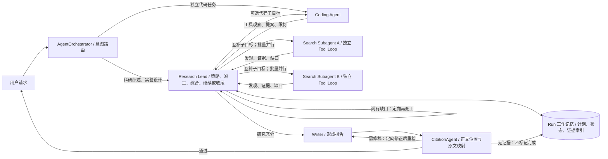
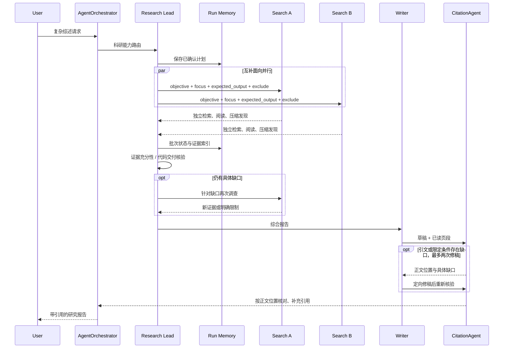

# Asteria 科研链路：参考 Anthropic Research 的架构对齐草案

日期：2026-09-24。状态：**科研角色、工作记忆、子任务产物、知识库 MCP 与引用修稿链路已接通；指定来源综述已完成一次真实登录到报告发布的端到端验收。** 以 Anthropic 的科研协作架构和职责为参考，不复制其未披露的技术栈；保留按批等待；用 CitationAgent 替换当前在线 Reviewer，而不是仅更名。

## 当前可用于面试讲解的 Asteria 架构图

这里的 **AgentOrchestrator 是 Asteria 的产品入口**，不冒充 Anthropic 图中原本不存在的跨业务路由。每批子任务回收后，结果作为观察交给 **Lead 下一轮模型决策**；由它选择补研或 `finish`，不再调用独立充分性裁判，也不由程序替它自动收尾。`working-memory.json` 存计划引用、阶段笔记、Lead 决策与子任务产物索引；`remember` 更新笔记，`read_artifact` 分页读取本 Run 的完整产物。当前不是进程崩溃后的自动断点续跑引擎。CitationAgent 在 Writer 之后核对原文映射，缺口返回 Writer 定向修稿，重新核验后交付。

一手资料：[Anthropic, *How we built our multi-agent research system*（2025-06-13）](https://www.anthropic.com/engineering/multi-agent-research-system)，重点看 Architecture overview、Prompt engineering、Production reliability 与 Appendix。本文区分 **原文披露**、**Asteria 当前实现**、**建议设计**；不能从示意图倒推出 Anthropic 未公开的代码、数据结构或停止阈值。

## 1. 总体边界：两个不同的入口

- **原文披露**：用户提出研究请求，系统创建 LeadResearcher；Lead 制定研究策略、产生各自负责不同面向的搜索子 Agent、综合发现，决定继续研究还是完成；研究结果和报告随后交给 CitationAgent 定位引文。文章没有介绍一个 EchoMind 式的跨业务意图分类器。
- **Asteria 当前**：`AgentOrchestrator` 做意图识别/澄清及业务入口路由；综述与实验设计交给 `research_lead`。`AutonomousReview` 做研究计划、并行委派和报告生成。这是产品所需的外层入口，不能说成 Anthropic 图中的 Lead 本身。
- **建议设计**：保留外层 Coordinator，但让 Research Lead 的职责尽量贴合原文。独立代码任务直接进入 Coding Agent；包含文献研究和代码分析的复合交付由 Lead 负责整体，再定向委派代码子目标。**独立路由与被 Lead 调用不冲突**。修改文件、执行实验必须受当前实际工具能力与审批边界约束，不能把只读调查/提案写成已执行。

## 2. Lead 的职权：研究策略、派工、综合和继续/收尾

**原文披露**：Lead 分析请求、制定策略，并把不同研究面向交给并行子 Agent。每个子 Agent 独立搜索、评估工具结果，再将压缩后的发现返回；Lead 综合结果，判断是否还需要研究，必要时再派工或调整策略。原文还强调根据查询复杂度分配工作量、先宽后窄搜索、避免让多个子 Agent 做同一件事；没有公开 Lead 的固定停止算法或 Reviewer 门槛。[来源](https://www.anthropic.com/engineering/multi-agent-research-system)

**建议设计**：把现有 `ReviewPlan` 概念上拆成两个层次，而不是把“研究目标/过程要求/交付约束”当成完整的研究计划：

1. **任务契约（小而稳定）**：原始用户目标、来源/执行范围、必须满足的数量或格式要求、禁令、批准状态。逐条保留用户原话，检查能否执行；不再用第二次 LLM 分类悄悄把“至少阅读两篇论文”移出过程要求。
2. **研究策略（动态）**：研究问题、互补调查面向、各面向优先来源、预期证据、未知点、预算和建议写作结构。Lead 可依据发现修改策略；章节只是一种最终组织方式，不必等于子 Agent 边界。
3. **执行中的 Lead**：观察子任务回传与证据覆盖，合并重复发现，识别缺口和冲突；只有针对未解决问题再次派工。达到交付条件则停止搜索，不为耗尽行动预算而研究。

### 综述任务的示例派工

输入：比较科研 Agent 端到端评测中的任务成功、证据忠实性、过程效率和人工校准，至少阅读两篇学术论文，给 10 人实验室提出轻量方案。

| 子任务 | 独立问题与预期输出 | 排除范围 |
| --- | --- | --- |
| A：任务成功 | 指标定义、典型任务集、成功判据、原文证据与局限 | 不代写完整综述；不重复 B/C 的主问题 |
| B：证据忠实性 | 事实/引文如何核对、代表方法、失效案例与原文位置 | 不把检索命中率当成忠实性 |
| C：效率与人工校准 | 成本/延迟/工具效率、人工复核设计、适合小实验室的权衡 | 不凭空声称实验室指标已经实测 |

Lead 可保留跨面向的综合与最终方案，某一路发现方法冲突后再开**针对冲突**的补查。每个任务应交代目标、预期输出、工具/来源指导、边界与预算；不同面向可以引用同一篇论文，但不能仅换标题重复回答同一个问题。原文给出的按复杂度调整子 Agent 数和工具调用量是其经验，不是 Asteria 的固定配置或验收指标。

**Aspect 到底是什么**：由当前请求决定、可相对独立探索的研究切面或子问题，而非固定角色表、资料类型或报告章节。Lead 可以按方法、对象、时间段、地区、争议点等维度拆，但一次派发应选一套能覆盖任务且少重叠的维度。判断分工区分度看“要回答的问题和预期结论”是否不同，而非搜到的论文是否完全不同。Anthropic 没有公开通用的 aspect 生成算法。

**Output format 到底是什么**：指子 Agent 交给 Lead 的统一结果形态，而非要求它写成最终报告。例如 A 的委托可以是：目标＝回答任务成功如何定义与测量；可用来源＝论文原文及权威基准文档；不负责＝忠实性和最终实验室方案；回传＝关键发现、各发现的来源/原文位置、适用条件、反例或不确定处、仍待回答的问题。这样 Lead 能比较、合并并判断是否继续，不必从三篇完整小综述里重新提取证据。

## 3. 子 Agent 交付和并行瓶颈

**原文披露**：子 Agent 有自己的上下文窗口，围绕各自任务迭代使用搜索工具、判断结果，向 Lead 回传压缩发现。文章的生产实现按批同步等待子 Agent；运行中的子 Agent 不能彼此协调，Lead 也不能实时指导它们，慢分支可能拖住整批。原文把这写作已知权衡，而不是多 Agent 不成立的证据。附录还建议子 Agent 可将完整产物持久化到外部，仅把轻量引用交给 Lead。[来源](https://www.anthropic.com/engineering/multi-agent-research-system)

**Asteria 当前**：`dispatch_assignments` 按不同目标派发，`run_parallel` 逐路保存/推送阶段结果，Lead 等待整批结束后继续决策；子任务共享整体预算。每路落盘 `subagent-<batch>-<index>.json`，保留委托、发现、证据、缺口和耗时；Lead 收到短摘要和产物引用，需要细节时调用 `read_artifact`。委托包含 objective、focus、expected_output、exclude、tool_guidance、source_guidance。论文批量 `read` 使用 `asyncio.gather`，共享 I/O 信号量和同源锁控制并发与重复下载。

**已对齐的设计选择**：保留按批并行、整批返回后由 Lead 综合和继续派工的模式，不把完全异步调度列为本轮优化目标。子 Agent 默认不直接互发消息；同一批可以共用来源/证据存储，但这不等于互相协调。跨分支的冲突、重复和补查由 Lead 在批次之间处理。前端可逐路展示阶段发现，但注明未综合。慢/失败支路保留已有结果并记录原因；是否加单路超时以实际测试为依据，而非先重做调度器。

## 4. Memory：运行时工作记忆，不等于用户画像向量库

**原文披露**：Lead 将研究计划存入 Memory，使长上下文截断后仍能取回；长任务可总结完成阶段并把关键信息保存到外部记忆，必要时新建干净上下文的子 Agent 做交接；子 Agent 的完整输出可独立持久化、Lead 只接收引用。原文**未披露 Memory 的数据库产品、Redis/ChromaDB 组合、向量检索策略或用户画像机制**。[来源：架构说明与附录](https://www.anthropic.com/engineering/multi-agent-research-system)

**对齐口径**：图中的 Memory 可以直接理解成 **Lead 的外部工作上下文**：计划、阶段摘要、子任务状态、证据引用和未解决问题可写入并取回；它不要求 Lead 永远把全部原文放在模型上下文窗口里。技术实现自行选择，可复用现有基础设施，不以使用与 Anthropic 相同的存储产品为目标。Asteria 仍应区分两种用途：

- 跨会话产品记忆：现有 Redis/ChromaDB 用户画像、历史研究摘要等，服务个性化和召回；这不是 Anthropic 图中 Memory 的已证实实现。
- 单次运行工作记忆：任务契约、可修订计划、每路状态、证据索引、决策依据、阶段摘要与剩余缺口；要求可持久化、可恢复、按用户/Run 隔离。优先复用现有持久化 Run 与 `plan.json`、`delegations.json`、`evidence.json`、事件日志，缺失的仅补最小状态；大文件按引用传递，不反复粘贴进 Lead 上下文。

现有 Redis＋ChromaDB 可按适合的数据类型复用；关键验收点是 Lead 在上下文压缩/任务恢复后还能找回研究计划和有效证据，不是存储品牌。

## 5. 收尾、CitationAgent 与现有 Reviewer：不能仅改名

**原文披露**：Lead 综合子 Agent 发现并决定是否需要继续研究；有充分信息后退出研究循环，CitationAgent **处理文档和研究报告，定位引文的具体位置**，再返回带引文的最终结果。文章未披露独立 Writer 的内部实现，也没有声称 CitationAgent 是独立的目标充分性裁判，或存在“审查三次后强制通过”的机制。文中的 LLM-as-judge 属于**系统评测**，不等于运行时 CitationAgent。[来源](https://www.anthropic.com/engineering/multi-agent-research-system)

**Asteria 改动前**：`ReviewerAgent` 在 Lead 主动 `finish` 或轮次耗尽时检查目标证据与代码交付；通过后 Writer 才生成报告。写作后的校验主要检查引用来源和形式，尚无独立的成稿正文位置引文定位。默认单目标连续 3 次打回停止，复杂综述可能在首轮检查之前重复派工。

**已接入的设计**：CitationAgent **替换在线 Reviewer 角色**。旧 `reviewer.py` 与独立充分性评估代码仅保留作离线诊断，在线研究链路不调用。已删除派发前的独立语义审批，以及批次回收、主动结束和预算耗尽时的强制充分性关卡。Lead 自己综合子任务答复；CitationAgent 不裁决是否还要重新开展研究。

1. **Lead 负责研究是否充分**：按 Anthropic 的职责，在一批发现回来后综合覆盖、证据质量和冲突，决定继续/收尾；不足只派发具体缺口。实际搜索/引文追踪次数作为工具观察提供给 Lead；程序验证非空原文、引用属于已读来源、权限和预算，不另设语义充分性裁判，不假称 Anthropic 原文规定了 Reviewer、检查频次或停止阈值。
2. **Writer 形成稿件后再由 CitationAgent 核引文**：输入稿件、原文页段与来源元数据；按每批 12 个正文位置核对中英文段落和表格行，跳过标题、代码块与参考文献标签。事实和分析必须绑定原文证据；明确的建议与局限可以没有引用，但不得夹带无证据事实。公共来源补链接，内部资料补 `〔KB:<片段标识>〕`，由 `knowledge-sources.json` 解析文档版本与页码。当前仍为正文行级、模型判断的来源映射，不能等同逐论断客观正确率保证。
3. **代码/实验要求单独验收**：文件实际变更、测试结果、实验日志等需与工具观察对应；CitationAgent 不负责宣布代码已运行或实验已复现。
4. **有界补研/修稿**：研究使用全局行动、子 Agent 数量与超时预算，不再使用旧裁判的目标打回次数。Lead 可将非核心未知写为局限，不必重新派发整套目标。CitationAgent 将缺口正文位置交回 Writer，最多两次定向修稿后重新核对；保留每版草稿与 `citation-history.json`。修稿不能改动无关行、表格结构或凭空补事实。最终仍不足则保留诊断产物并报告未完成，不把失败报告标成成功。

## 6. 本轮已实现与后续验收

已实现：并行批次回收后由 Lead 下一轮自主决策；独立 CitationAgent 成稿定位；研究任务可用公开网页搜索发现**受白名单约束**的一手来源；单 Run 工作记忆快照；输出 `lead_decisions`、`citation_review` 与 `working_memory` artifact；配套替身单元测试。研究者仍可独立选择自查或派工，不强制并行，不预设 aspect 数量。已有分工合同中的 `objective/focus/expected_output/exclude` 是委托给子 Agent 的输入契约，不是四个新的固定研究阶段。

已验证一次指定来源综述的真实服务端完整请求、PDF 发布及认证下载（第 8 节第四轮）。仍需验证：开放式复杂综述的覆盖质量、CitationAgent 的误拒/漏检、公开搜索源的稳定性、多任务可靠性与知识库 MCP 参与的完整研究链路。不能仅凭单次成功或架构图写“已在生产验证”。

1. **冻结基线**：同一复杂综述 prompt 记录当前路由、计划、派工、首路/整批耗时、证据、首次审查时机、最终状态；保留现有失败 trace，不覆盖。
2. **重构规划状态**：任务契约与动态策略分离；原话不丢失、不重复分类；针对纯综述、限定来源、复合研究＋代码任务测试入口所有权。
3. **Lead/Subagent 闭环**：明确互补任务契约和阶段产物；首批回收即检查有效证据与缺口；仅针对缺口二次派发，限制相同目标重复委派。慢/失败支路不抹掉已取得的证据。
4. **CitationAgent 深化**：增加表格、短句与多论断长句覆盖；对无支持行触发有界修稿/补研，不仅停在审查 artifact；人工核查误拒/漏检后再删除旧模块。
5. **真实用户验收**：至少覆盖复杂综述（含两篇学术论文、来源分级）、单问题无需并行、子任务慢/失败、无新证据上限、报告错误引文、科研＋代码复合请求。分别记录产出质量、重复调查、首次可用发现时间、整单耗时和成本；同配置与基线对比。自动化替身通过不等于真实模型端到端完成。

**非目标**：不声称完全复制 Anthropic 内部实现、不替换产品跨会话记忆、不自动授予写文件/执行实验权限、不用 CitationAgent 掩盖研究目标或过程要求的验收缺口。

## 7. MCP 与 Tool：现状、缺口及接入顺序

| 能力 | 当前真实接线 | 本轮状态 / 下一步 |
| --- | --- | --- |
| arXiv 检索、论文读取、页段读取、引文追踪 | `PaperLibrary`，Lead 和 Search 子 Agent 共用任务范围证据；Coding 子 Agent 有同源论文工具 | 已有，摘要/检索命中不计作原文依据 |
| 公开网页搜索 | `search_public_sources` 注入科研 Loop，最多取 5 条，只有通过 `primary_sources.validate_url` 的一手域名可加入读取目录 | 本轮接通；Tavily Key 可选，未配置则 Bing RSS；搜索摘要不是报告证据 |
| 实验室知识库 | `search_knowledge` → 本地 stdio MCP `search_lab_knowledge` → `managed.retrieve` → 既有 Modular RAG/Chroma 索引 | 已接入 Lead/Researcher；身份与库范围由服务端绑定，每次调用复查权限；返回 chunk、文档版本和页码；真实检索已返回 6 条片段 |
| 本地文件 MCP | `backend.files.mcp_server` 的 `list/read/propose` 通过 `build_coding_tools(owner)` 给 Coding 子 Agent，提案需人工批准 | 已有但仅限认证用户；不是自动写入或删除文件 |
| GitHub 仓库调查 | `repository_tools()` 提供固定仓库范围的 inspect/read | 已有；不能声称可编辑任意仓库 |
| 运行实验、Shell、改代码后测试 | 当前科研 Coding 子 Agent 只读调查、语法/差异预览及提案；无通用执行器 | **未实现**；接入前先设计隔离工作区、命令白名单/审批、超时/资源限制和可复核测试日志，不把“规划实验”写成“执行实验” |
| 引文核验 | `CitationAgent` 核对正文与表格，关联公共 URL/私有 KB 引用，最多两轮定向修稿重检 | 已接通，保留 `citation-review.json`、`citation-history.json` 与修稿版本 |

Tool 是 Agent 能调用的具体能力；MCP 是部分能力的接入协议。知识库和文件采用实际 stdio MCP，论文目录、页段、记忆和子任务调度采用进程内 Tool，便于维持同一 Run 的证据与预算。未配置第三方 MCP 可执行文件或密钥的任务不会动态安装任意服务。实验执行仍单列为后续能力，不能把代码提案写成已跑实验。

## 8. 2026-09-24 工程实现与实测问题

- 已移除主链路中的二次目标分类。一次规划区分研究目标、明确过程要求和交付约束，结构化重复 ID 直接规范；用户确认后不再自动迁移实质问题。
- CitationAgent 的原文证据按 2400 字符窗口、200 字符重叠编目。这不是 Lead 的子任务汇报上限：Lead 收到完整的有界 `summary`（最多 12000 字符）、`gaps`、委托目标、来源索引和产物文件名；完整证据保留在磁盘，可按需读取。子 Agent 无需同时写一篇长 aspect 报告和第二篇短汇报，当前以一份结构化结果及对应原文证据为准。
- 第一轮真实验收（Run `4534a939ff72401298f227cd321e5973`）三路并行成功，但因证据截断和额外索要去重量化指标而未交付；原始任务与事件保留在 `outputs/acceptance_c47085a7c4/`。
- 第二轮仍被旧裁判的 schema 拒绝：模型在说明里引用 ID 却省略支持列表。记录在 `outputs/acceptance_cca171628f/`。重新对齐用户意图后，不再继续加强这道在线关卡，而是移除在线独立裁判，让 Lead 处理子任务汇报并自主收尾。两次失败记录保留用于对照，不改记为通过。
- 可复现真实验收：`python scripts/accept-research-chain.py --approve-plan --timeout 1800`。使用真实登录、HTTP 路由、独立 worker、报告发布与持久化，消耗已配置模型额度；专用测试账号与报告保留，临时密码不会打印或落盘。`--task-file` 可替换任务，`--direct-read` 可关闭全文向量检索。

### 第三轮真实验收：Lead 自主收尾，引用阶段因余额不足停止

Run：`3c0aa28f2a134089bfcbc408ede98c6a`；运行目录：`outputs/review_79550b3f025a4c17bf74edab31679a1c/`；请求目录：`outputs/acceptance_81d2333e79/`。

- 通过真实登录和科研路由，首批派发 ReAct、AutoGen、Anthropic 三个互补子任务，分别约 23.4、26.0、14.5 秒回传（相对本批派发，不是整个请求延迟）。
- Lead 收到三份汇报后自行补充两项交叉验证，而非旧充分性裁判强制打回。后续搜索出现超时/空结果，部分阅读碰到全局 120000 字符预算；子任务如实回传限制。
- Lead 依据原始请求“不要求穷尽文献”选择 `finish`，未强行重新派发。Writer 生成 `draft-1.md`，经过来源集合和基本格式检查；**这些检查不代表事实核验已经通过**。
- CitationAgent 首次模型调用返回 HTTP 402。`run.json` 记录失败，研究约 297.4 秒、5 个子 Agent、53 次行动、71 次模型调用、独立充分性检查 0 次。输入字符数不是计费 Token，不能据此计算费用。
- 结论：**研究循环到草稿已经实测可达；最终引文核对和 PDF 发布仍未端到端通过。** 不将这次任务算作成功样本，也不将草稿当作已验收报告。

此次测试还暴露了研究 Skill 中残留的独立裁判描述，现已升级为 v5；同时向各 Agent 显式提供剩余原文阅读预算。这两项在第三轮启动之后修改，尚待下一次真实任务验证。模型余额恢复前不自动重试付费请求，也不静默切换其他供应商。

后续验收重点：确认 v5 下补研与请求深度匹配；空搜索能缩小检索式或及时回传限制；CitationAgent 能完成正文归因；最终产物能经认证下载。已保存现有证据和草稿，定位引用阶段问题时可以复用这些输入，不必为每次调试重新开展全部研究。

本轮工程回归：默认测试集 288 passed / 5 skipped；启用隔离 PostgreSQL schema 的 Run 生命周期测试 3 passed；前端 TypeScript 类型检查通过。部署预检确认 PostgreSQL、Redis、API、bge-m3 Embedding、XeLaTeX、知识库及文件 MCP 均可用。上述检查不包含余额恢复后的真实模型验收，不将通过项相加解释为业务测试覆盖率。

### 第四轮真实验收：余额恢复后完成报告交付

Run：`e100e1d6ea1e455ebaab46a714fd3a95`；请求目录：`outputs/acceptance_c9ce969622/`；研究目录：`outputs/review_232ef2f8303445359d466c34321ac029/`；原始发布目录：`outputs/scientific_5973c75d480f44fd8648bda74f9a79b8/`。第三轮的失败状态及产物保持不变，本轮是新请求。

执行 `python scripts/accept-research-chain.py --approve-plan --direct-read --timeout 1200`，通过专用账号登录、Coordinator 路由、计划批准、独立 worker 执行到最终发布。任务比较 ReAct、AutoGen 与 Anthropic Research，提出适合 10 人实验室的架构建议；提供三份初始资料，不要求穷尽文献，不要求运行代码。

| 观察项 | 实际结果与口径 |
| --- | --- |
| 最终状态 | `completed`，生成 Markdown、PDF、引文核对与 Lead 决策产物 |
| 请求总耗时 | 约 98 秒；研究记录为 87.79 秒，后者不含完整发布耗时 |
| 并行分工 | 一批 3 个子任务，分别分析 ReAct、AutoGen、Anthropic 的不同协作机制 |
| 子任务回传 | Anthropic 12.54 秒、AutoGen 20.21 秒、ReAct 22.35 秒，均相对本批派发计时 |
| Lead 收尾 | 收到汇报、写工作记忆后选择结束；未再派发补研，独立充分性裁判调用 0 次 |
| 调用规模 | 35 次模型调用、31 次行动、3 个子 Agent；不将字符数等同于计费 Token |
| CitationAgent | 核对 10 个正文行单元，首轮完成，未触发定向修稿；不是 10 个独立事实的准确率统计 |
| 下载验收 | 登录后报告、PDF、引文核对与决策记录均 HTTP 200，长度及 SHA-256 与产物记录一致；未登录下载 PDF 返回 401 |

本轮还暴露并修正了两类工程边界：

- URL 提取器误把中文全角冒号后的来源标签并入地址，导致两次 `finish` 被格式校验拒绝，第三次成功。现已将中文冒号及常见引号/括号视为 URL 边界，补充回归用例。这是来源格式问题，不是又一次研究充分性检查，也未触发补研。
- 导出 PDF 出现集合符号缺字、模板与正文双重编号、长链接溢出。安全渲染器增加受控数学符号、可点击 Markdown 链接及学术模板标题编号规范；修正非默认输出目录的返回路径。复用同一报告离线导出至 `outputs/export_verification/scientific_0dc0807bc805493c953326c11831a6fc/`，三页逐页检查，编译无缺字或溢出警告。原 Run 的原始文件及哈希未覆盖。

验收脚本现已把认证下载、哈希和 PDF 格式检查纳入后续运行，并保存 `downloads.json`。第四轮启动时脚本尚未载入这段新增逻辑，因此本轮下载检查是在完成后单独执行，不虚构其请求目录中存在该文件。

**解释边界**：本轮使用 `--direct-read`，知识库召回和 Embedding 调用均为 0，不能把本次通过写成 RAG-MCP 全链路通过。一次通过也不能证明引用判断完全正确，报告的数值对比、版本与发表状态仍需人工抽检。后续优先补开放式调研、知识库参与、多次同任务稳定性及科研＋代码复合请求，再开始 AstaBench 对接；不为更新文档重复消耗模型额度。

收尾回归：启用本机 XeLaTeX 后默认测试集 **291 passed / 5 skipped**（含真实中文及公式 PDF 编译）；前轮 PostgreSQL 隔离测试与前端类型检查结论不重复计入。确认无活动研究任务后更新 API 与 worker，健康接口和前端登录页均返回 HTTP 200，worker 处于运行状态。

### 第五轮：以交付可读性和信息保真为优先，不追加充分性关卡

用户在实际阅读器中发现中文全部消失。上一轮仅用 MuPDF 渲染通过不足以证明兼容性：XeTeX 已嵌入 Fandol 字形，但部分 Adobe-GB1 Type0 字体缺少 `ToUnicode`，不带外置 CMap 的 Poppler 报 `Missing language pack` 并拒绝显示中文字形。新发布流程从 TeX 的官方 CMap 资源嵌入映射（保留资源版权说明），不依赖用户安装字体包；部署预检同步检查该资源。旧 Run 的 PDF 和哈希保持原样，不用新导出覆盖历史证据。

本轮代码调整：

- 子 Agent 可选返回 `findings`：结论、适用条件、来源、局限一起传给 Lead 和 Writer；保留原始汇报产物，Writer 不再只依赖 Lead 的二次摘要。没有强制要求填满字段，也没有引入额外研究裁判。
- 写作依据原始问题组织结论、机制比较和实施建议；避免无关基准数字堆砌、重复长摘要和内部核验过程叙述。Citation 修稿优先删除无关且缺乏支撑的细节，而非把错误数字换成“尚未核实”的长段落。
- 篇幅统计统一为正文中文字符加英文/数字词数，排除引文链接和参考资料附录。明确“不超过”仍是硬上限；根据用户最新确认，“约 N 字”只作软提示并记录观察值，不单独触发修稿，不因为略超字数中止交付。内容覆盖与 Lead 的分析优先。
- PDF 保留加粗和行内代码，使用编号链接与参考资料对应，标题左对齐、去掉重复页眉并减少孤行。发布记录标记 `safe-markdown-v3` 及嵌入映射数量。

**保留失败而非改记通过**：Run `1aedfaf8b0e14e14afc0515e5e230686`（`outputs/acceptance_df1b811077/`）完成调研后，因早期实现将约 1600 字的容差作为硬门槛，最终草稿 1922 单位比 1920 上限多 2 而失败。这是本轮引入的交付逻辑错误，现已改为上述软目标，并增加“近似篇幅不能阻断交付”回归用例。

新增 `scripts/replay-research-report.py`，可从保存的研究目录复用任务、子任务汇报、证据及原文缓存，仅重跑写作、引文与发布；输出另存 `outputs/report_replay/`，不改原 Run。已完成一次这种报告阶段验证，但它不等于真实登录、路由、worker 和下载的端到端通过。其最终约 2082 单位也说明软目标不保证模型精确遵守篇幅，不以通过状态掩盖质量不足。

工程回归：**296 passed / 5 skipped**，包含真实中文 PDF 编译、Poppler 渲染错误检查、映射幂等、结构化发现无损交接及篇幅边界测试。事实幻觉仍需抽检；本轮不声称解决所有数值或文献归因问题。

### 本轮最终验收与明确保留的问题

- Run `e4adff1435d3434ebd6b93e9aea5b360` 完成研究和写作后，因为 CitationFinding 的说明超过 500 字符失败。已移除说明字段这个非必要的长度硬限制，保留完整原始响应和说明，行号、证据 ID 等实质结构校验不变；新增回归测试。不把失败改记成功。
- 随后新 Run `d28aa6944e7548819ebc266fcb108e41` 完成真实登录、路由、计划确认、三子 Agent 并行调查、Lead 综合、写作、引用与发布，总执行约 **152.79 秒**。请求记录 `outputs/acceptance_e5909b6bb6/`，研究记录 `outputs/review_f4281651ea7c403a8ed8933fd33f83df/`。报告/PDF/引文核对/Lead 决策四项认证下载均 HTTP 200，并核对长度与 SHA-256。
- 三子任务在同一批并行，首个结果约 52.88 秒回传，全部约 61.83 秒；Lead 未再次派发。独立充分性裁判调用 0 次，Citation 首轮完成。全 Run 58 次模型调用，不把单次通过解释为可靠性统计。
- 新 PDF 三页以此前报缺字的 Poppler 逐页渲染，中文、标题、公式及正文可见，无 Missing language pack / Unknown font 错误。另修正正文引用顺序与文末列表顺序不一致时的编号映射；重新导出另存，不覆盖已登记产物哈希。
- 人工内容评估：报告有“结论—机制对照—并行去重—上下文保留—实验室建议—局限”的主线。子任务按机制、专项问题、落地建议区分，但都阅读了相同三份来源，仍有重复阅读成本；Lead 和报告仍保留部分无关指标与重复限制说明，部分发表状态/事实归因需要人工复核。这些是真实剩余质量问题，不通过加一层硬裁判或反复凑字数处理。
- 本次仍为三份指定来源的 direct-read 验证，不代表开放检索、RAG 或实验执行全链路通过。arXiv 空结果/连接错误在前一轮补研中出现，尚不能据此认定检索功能稳定。
- 最新回归 **297 passed / 5 skipped**。上述真实 Run 启动时近似篇幅仍允许一次修稿；用户进一步确认后改为仅记录提示，该小改由回归用例验证，未再为字数问题重复消耗一次完整模型请求。
